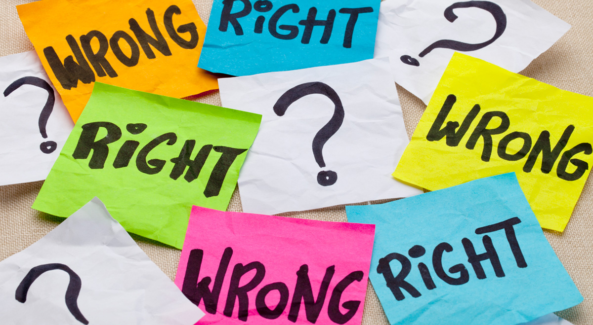

# Ethics in Software Engineering
First, what is ethics? 

  

According to Webster's dictionary definition, ethics is the moral principles that govern a person's behavior or the conducting of an activity. Putting this into the context of Software Engineering, I believe it means that before we perform an action such as coding up a project or writing a script, we should ask ourselves "is this ethical?". 

Speaking frankly, I know others who have written many scripts that may be considered on the gray side of the law. Stuff similar to pirating media content, nobody cares, but it's still illegal. Most of the time, I reason to myself that its not hurting anyone, and that's usually true ... most of the time. What's important is the times it does.

  

## The code I'm still ashamed of

In "The code I'm still ashamed of", the author describes a scenario where he was faced with an extremely ethical decision. Working at a medical marketing firm, he is instructed to code up a forecast quiz where all the results lead to the same answer, buying a singular product. Consider the saying "all roads lead to Rome", but with medicine. Later on, he finds out that the prescription drug he has created the website for has led to the suicide of a young teenage girl. After this, he says nothing and just quits.

The question is, did the author of this article have an ethical decision to speak up about first, how all the results led to promoting a singular product, and second, to speak up about how the product was harming people.

My answer is that the author should have spoken up about the second, but not the first. In response to the first question, misleading results have been a marketing technique in digital marketing for a while, and since doing it does not necessarily harm anyone, I do not believe he should be ashamed of doing it. I do think however that he should have said something to someone when he found out that the drug they were promoting was harming people, he should have said something. Whether to his boss, or his boss's boss, he should have done something.

That's my take on it, what's yours?
