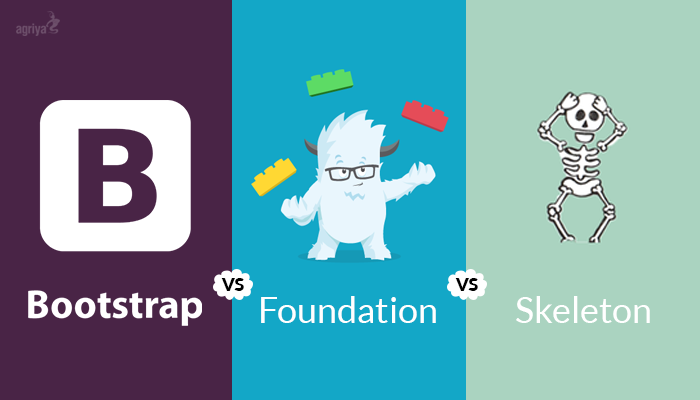

<h1>Frameworks</h1>

What's the difference between UI Frameworks like Bootstrap, Foundation, or Semantic?

...

<strong>Nothing!</strong>

  

<h2>The War</h2>

Many people have argued over what the best CSS framework is.

Many people are also stupid.

Who cares if you use something like Bootstrap instead of Semantic? I'll tell you right now, <strong>nobody!</strong>

People have different preferences on which framework to use and if you compare them, one framework might look better than another. But ask that same question to over one hundred with some of the top frameworks, and you'll find a wide spread of opinions. 

Everyone has a different opinion as to what a website should look like. Some people like large empty spaces on their page, while others enjoy having a lot of information in one area. <strong>You can't design your site a certain way and have everyone like it.</strong>

However, on the discussion if you <i>should</i> use a framework, the answer is a most definite yes.

Why spend time writing custom CSS classes and designing custom layouts when it has already been done for you? Think about all the things you can do with the time you waste writing custom rules.

<strong>More time saved = More time developing = A better product</strong>

That's what you should be focusing on, making your program the best it can be. Not trying to get a div line up correctly.

