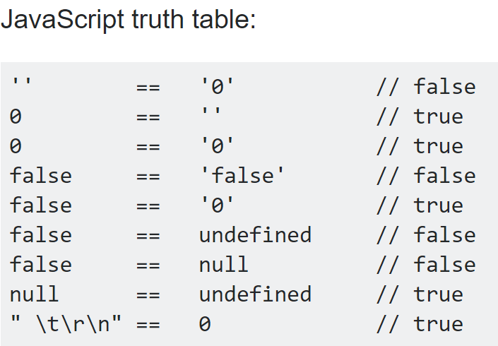

# What do you think about Javascript so far?

I think JavaScript is a fun and useful language whether your using it to code a project or write a simple script. It lets you quickly spin up examples and projects easily, since you can use it for your front-end as well as your back-end through Node.js.

# If you’re a complete newbie, how does it compare to other programming languages that you know? If you have prior experience, did you learn new things from this module, perhaps with respect to ES6? 

I learned about what `for .. in` and `for ... of` loops do in respect to Arrays. Otherwise, everything that was in the module was review for me and I'm glad I read it since reviewing topics is always good to do.

# Do you think Javascript is a good or bad programming language from a software engineering perspective?

I think it's a good programming language for software engineering as long as you are careful. JavaScript is weird sometimes with logic. For example: 

  

As you can see, JS is not the best language for comparisons, and this feature of the language might be disastrous and confusing for newer programmers.

# What about athletic software engineering? 

I actually really enjoy the WODs. I think they give me a good measure of my programming ability and help me understand the areas I need to work on. 

# Did you find the practice WODs to be useful? What do you think about this style of learning? Is it stressful? Is it enjoyable? Do you think it will work for you?

I found the practice WODs to be extremely useful. I found this style of learning quite fun and entertaining, as I really enjoy the process of thinking through the solution and finally programming it.