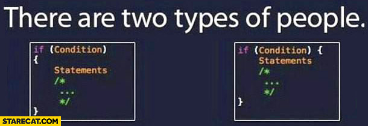
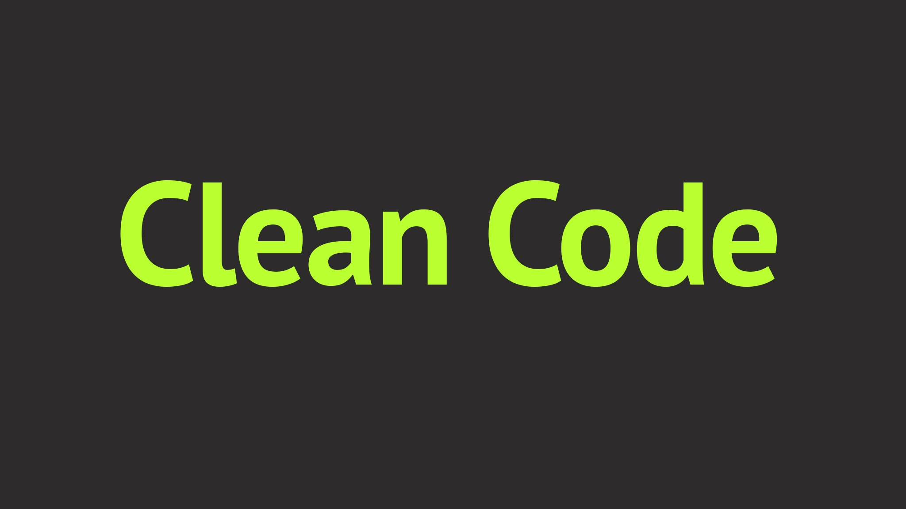

# Reflecting on Coding Styles

My experience with coding styles has always been the same throughout all of the projects I've worked on. If it works, it's fine. 

There have been so many times when people have commented on my code for being so dynamic. Sometimes I agree with them, sometimes I don't. But at least I can always say one thing, "It works". 

Honestly, I think too many people spend too much of their time arguing about different coding styles. Who cares if you abide by Google's or Airbnb's coding standard, and who cares if your brackets are on the same line as your conditions or below it.

  

There should only be one main goal in a programmer's mind when writing his code. Does this work? 

They shouldn't have to worry about abiding by different coding standards and ideas until after they verify the code works. Only after they verify that should they worry about the semantics of different coding standards.

  

On the topic of coding standards and IntelliJ, getting that green checkmark has been pretty easy for the most part unless you are trying to put all your code on one line 😉. I have extreme OCD, so my code is always pretty clean for the most part. But on the topic of does a coding standard help you learn a language, my answer is that it might, but it's not the first thing I would do. When learning a new coding language, I would first look at examples of that language in use, not it's standards of code.