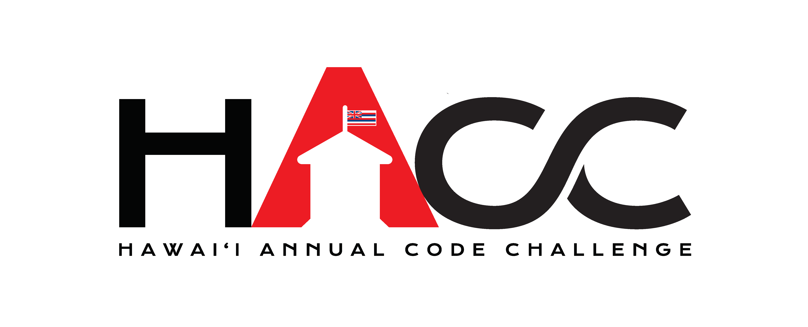

# Software Engineering and Me

Software development has always been fascinating to me. Whether it be writing code or reading it, there is always fun to be had.

One of my main goals in becoming a Software Engineer is to create an application that people will use. This goal is important to me because if people will use the applications I make, it will give me the confirmation I need. I hope to fulfill this goal of mine this year's HACC (Hawaii Annual Code Challenge). 

  

I am currently working on the UH_Wayfinder challenge, which is a challenge to give the University of Hawaii a better navigation system. This would stop random japanese tourists from asking you for directions, and would improve navigation for campus newcomers and visitors. 

We are planning on creating both a mobile and a web application, which would allow users to either download our app or visit our website. This would allow for users to view the application on their phones easily, since our main goal is to make our application mobile friendly.

Hopefully this hackathon will allow me to fulfill my main goal so I can gain the confirmation I need.