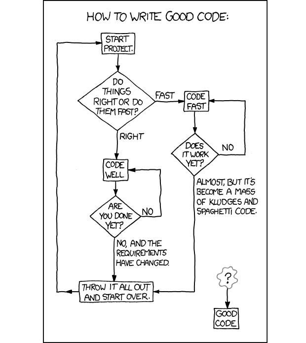

# Design Patterns
To me, design patterns are just ways of structuring code, something that many people do differently in the field of Software Engineering.

# The Right or the Wrong

Software Engineering is not only writing code, it is an art. And like any art, there is no necessarily right or wrong way to do things. Software engineers write millions of lines of code every day. And whether they use Python, JavaScript, or Ruby, they all have their different ways of doing things, and neither of them necessarily right or wrong.

  

# Examples

Imagine reading through the code structures of different projects using different frameworks, do you expect them to be the same? I don't think so. And these projects are being changed almost every single day. We can say a project is modular or well-structured or anything we want. But is it really? From my experience, no matter how good we think a piece of code is, it can always be improved. That is why we can't really judge whether the design pattern in a project is good or not, because what is considered a clean design pattern is always changing.

  

# What really matters
What really matters when designing a pattern is consistency. If you look at the greats, all the style guides from companies like Google and AirBnB, you can see that they have all one thing in common, they are all consistent with themselves. This is because if design patterns are always changing, consistency is the only trait we can truly value. _In all disorder, there is a secret order - Carl Jung_. In writing code in regards to design patterns, that secret order is consistency. If we are consistent in writing our code, then we can always know what's happening in our code.
