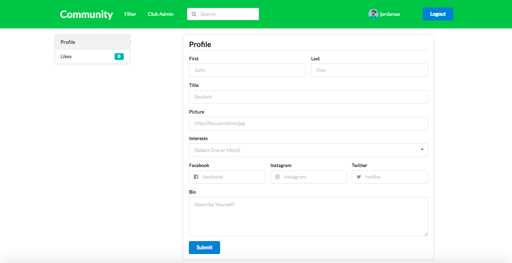
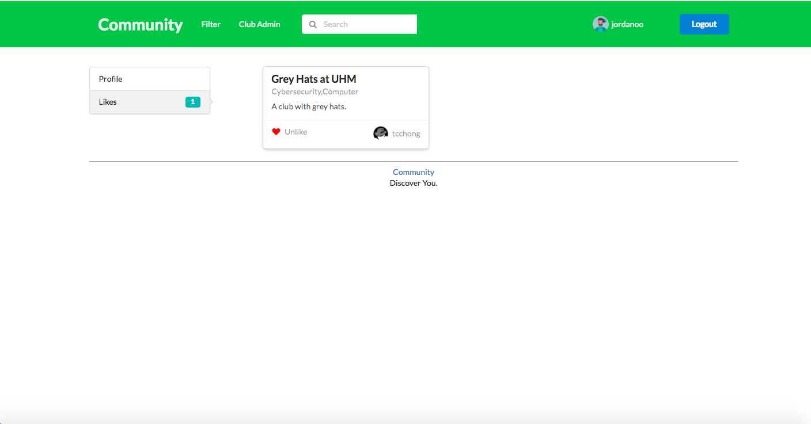
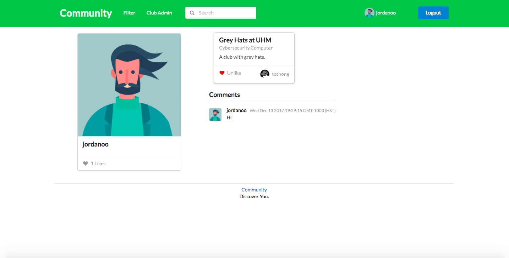
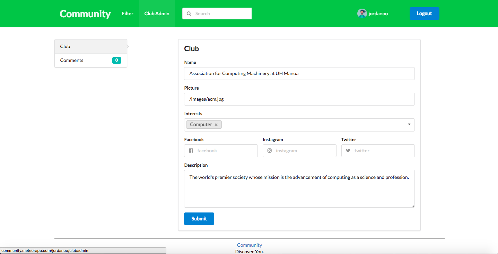
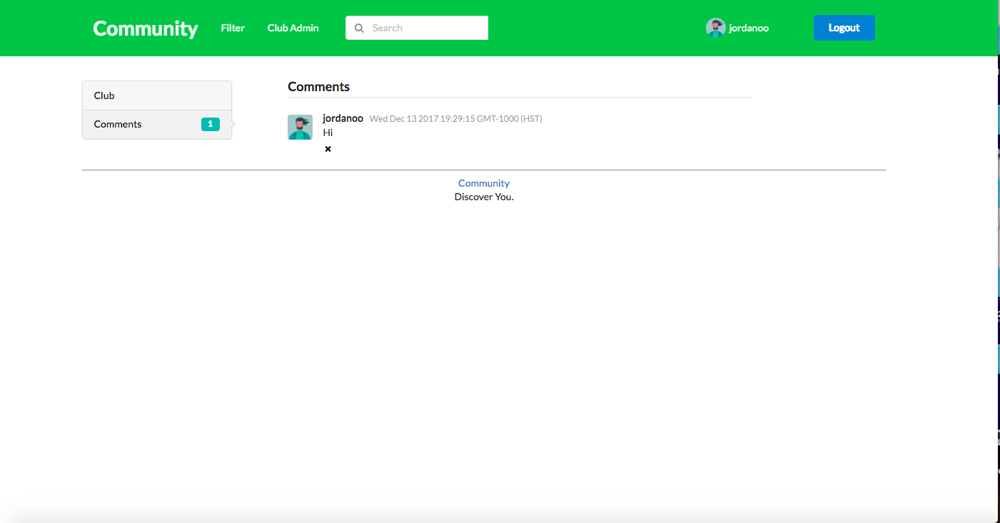

# UH Community

During my time in ICS 314, me and two other group members created UH Community, a way for University of Hawaii members to discover different organizations on campus. 

## Our Reasoning
We wanted to work on this project because we felt like this was a problem that need to be solved. The current way for UH members to discover clubs is to load up a huge Google Spreadsheet and look through it, without any way of searching or filtering. We decided to try and solve this with our project, UH Community.

## Our Process
In the beginning of creating our project, me and my other group members met up and planned our creation of the project. We drew page mockups, and wrote down the process we would need to take in order to make a functioning application. Doing this was very beneficial since there were many times in the development process where we could look back at our mockups and refocus on things that we planned beforehand.

## An Overview
In our application, you can browse through the different organizations on campus, and filter them by your personal interests. 

  

In the profile page, you can fill out your profile, and get matched to various clubs on campus. You can also see the clubs you've liked here.

  
  

You can also view the profiles of other users, and see the clubs they have liked and the comments they have left on them.

  

On every club page, you can leave a personal comment about the club and/or give the organization a like.

  

On the admin side, verified club admins can also monitor comments and/or change the club information to keep it up to date.

  
  

## My Contribution
My main contributions to the project were implementing Comments and Likes, as well as the creating the Club and Profile pages and their respective needed components.

## What I learned
I learned a lot from this experience. This project gave me some real experience in working in a group, something that most other classes don't give me. What I learned in working in my group is that communication is key, and that minor miscommunications can build up and create severe application code conflicts. Another thing I learned is that while developing in a group, it is important that everyone has a clear goal about what to do, so they aren't doing nothing.
