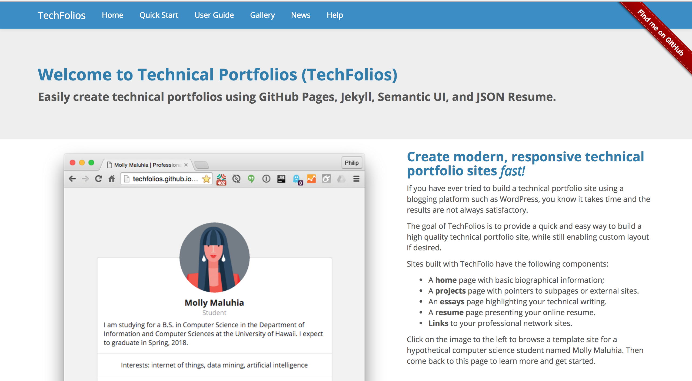

Over the summer, I worked on Techfolios as a part of an ICS 499 class.

  

Techfolios is meant to be a resource for people to build their professional techfolio portfolio, and I worked in a team in order to simplify that process through a Desktop application.

This experience helped me gain experience in Node.js as well as Electron, Semantic-UI, and React as that was the tech stack.

It also helped me gain experience in working in a team. This includes F2F (Face to Face) interactions as well as using Git branches/merging properly. 

It also helped me to be more accountable, as tasks needed to get done.

My main responsibilities were working on the "Bio" section of the project, but I also contributed to the other parts as well.

All in All, working on the Techfolio app over the summer was a valuable experience and I hope to work on other projects in the future.