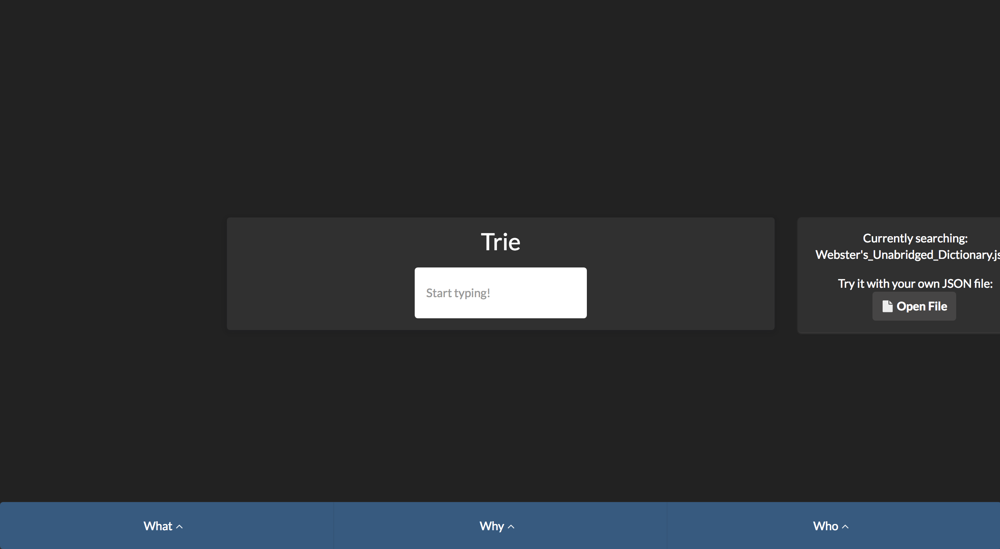
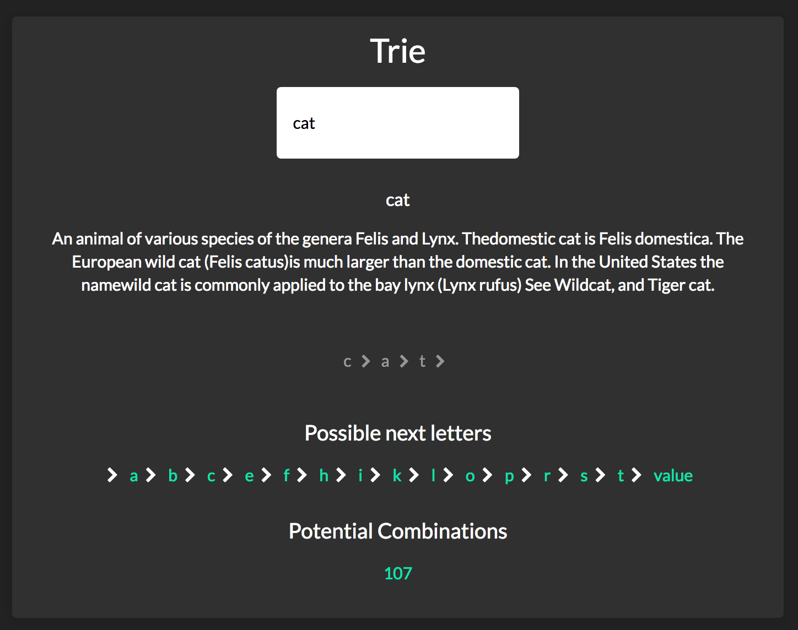

# A demonstration of Tries
## What
Tries are an efficient information retrieval data structure. Using tries, search complexities can be brought to optimal limit (key length).

## Why
Tries allow you to insert and find strings in O(L) time (where L represent the length of a single word). They also allow you to find words that have a single character different, a prefix in common, a character missing, etc.

## What this is
This is an attempt to visualize how a trie works. You can use the default JSON file, or put your own in. This currently lets you search the unabridged webster english dictionary through the input field. Once you type a letter, the components will dynamically react and show you the possible next letters and number of possibilities you have when you first type in that letter.

## Overview
This project was meant to show the use cases for a trie vs. a typical flat JSON object. Tries allow you to better see the things around the thing you searched for, as well as being able to contain any other information you wish.

  
  

